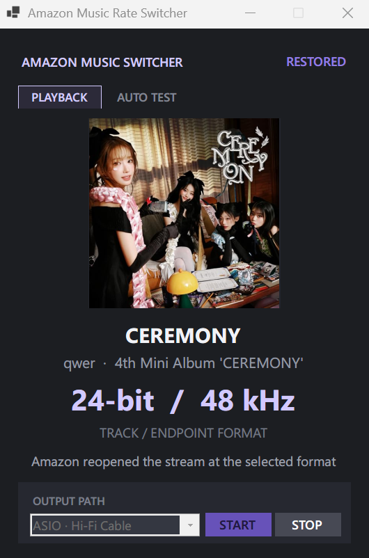

# Amazon Music Rate Switcher

[English](README.md) | 繁體中文

Amazon Music Windows 版的 Exclusive Mode 不會跟著每首歌的原生 sample rate 自動切換。這個工具會讀取目前播放格式並切換 Windows render endpoint，盡量減少不必要的 sample-rate conversion（SRC）。這是實驗性工具，無法保證整條 audio path 一定 bit-perfect。

<p align="center">
  
</p>

## Features

- 依照目前歌曲自動切換 sample rate 與 bit depth。
- GUI 顯示歌名、歌手、封面、播放格式與切換狀態。
- 支援 ASIO Bridge／ASIO4ALL 與 Windows Direct output。
- Format 改變時 queue-safe 重播同一首；格式相同時不中斷播放。
- 用 ASIN 配對 verified-format cache，加快常聽歌曲又避免套用上一首資料。
- 內建預設 10 首的 AutoTest，輸出成功率與平均延遲。
- 使用 OS-level single-instance lock 與 forced-close cleanup，避免 backend 殘留互搶。

## 快速開始

一般使用以 packaged EXE 為主：

1. 從最新 GitHub Release 下載 `AmazonMusicRateSwitcher-1.0.0-win-x64-Portable.zip`。
2. 解壓縮後執行 `AmazonMusicRateSwitcher.exe`。
3. 按 **Start**；第一次使用會自動安裝必要的 endpoint helper。

選 **ASIO** 會走 Hi-Fi Cable；選 **Direct** 會直接使用 Windows output device。執行 AutoTest 前要先播放音樂、開啟 autoplay，並確認後面至少還有 10 首可播放歌曲。

## Audio path

- ASIO：`Amazon Music → Hi-Fi Cable → ASIO driver/ASIO4ALL → DAC`
- Direct：`Amazon Music → Windows output device → DAC`

ASIO mode 是 global route；播放音樂時不要讓 YouTube、system sounds 或其他 audio source 同時走同一條 Hi-Fi Cable。有原廠 native ASIO driver 時應優先使用；ASIO4ALL 是 WDM compatibility layer，本身不代表一定 bit-perfect。

```text
Amazon Music
   ├─ Direct ──► Windows render endpoint ──► DAC
   └─ ASIO ────► Hi-Fi Cable ──► ASIO driver/ASIO4ALL ──► DAC

Rate Switcher ──► 切換所選 endpoint format
```

## 運作方式

程式優先讀取 Amazon CDP player state，再使用以 ASIN 配對的 `AmazonMusic.log` 與本機 verified-format cache。需要切換時會先 mute endpoint、套用目標 format，將目前歌曲 seek 到 Amazon 的 restart threshold 後，用有保護機制的 Previous command 重播同一首歌。一次切換通常會增加約 0.5～1.5 秒。

## 進階使用

一般使用建議直接開 GUI。CMD launcher 與 PowerShell backend 保留給診斷使用：

```powershell
.\Start-AutoSwitch.cmd direct
.\Run-AutoTest.cmd direct
.\scripts\AmazonMusicRateSwitcher.ps1 -Mode Devices
.\scripts\AmazonMusicRateSwitcher.ps1 -Mode Probe
```

Runtime state、聆聽紀錄產生的 cache、測試報告、build output 和下載的第三方工具都不會加入 Git。Repository 只把可維護的 GUI source 放在 `src`、backend 放在 `scripts`，本機 build 放在 `artifacts`。

若要自行 build self-contained EXE，安裝 .NET 6 Windows Desktop SDK 後執行：

```powershell
dotnet publish .\src\AmazonMusicRateSwitcher.Gui\AmazonMusicRateSwitcher.Gui.csproj -c Release -r win-x64 --self-contained true /p:PublishSingleFile=true -o .\artifacts\win-x64
```

測試環境：Windows 11 64 位元（build 26200）、Amazon Music Store package 9.5.2.0／executable 9.5.2.2478、PowerShell 5.1、VB-Audio Hi-Fi Cable 與 ASIO4ALL。

## 限制

- Amazon 更新後可能改變 private CDP／player structure。
- Windows shared mode 仍可能 mix 或 process audio；endpoint format 正確不代表整條 path 一定 bit-perfect。
- Device name 與可用格式取決於目前 Windows 安裝環境和 audio driver。
